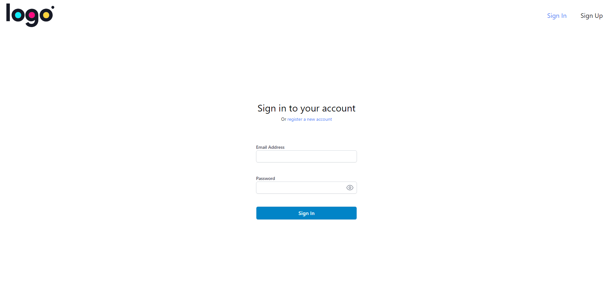

<!-- PROJECT LOGO -->
 

  

<h3 align="center">EC Hiring Task (Frontend)</h3>

  

    A responsive web application featuring secure authentication and dynamic product display with search and pagination.
     
     
    <a href="https://ec-hiring-task-rkr.vercel.app/">View Demo</a>
  

<!-- ABOUT THE PROJECT -->

## About The Project

This project is a submission for the Hiring Task from [Engineer's Cradle](https://engineerscradle.com/).

(<a href="#readme-top">back to top</a>)

### Built With

- 
- 
- 
- 

(<a href="#readme-top">back to top</a>)

## Features

- **Responsive Design:** Adapts to various screen sizes for an optimal user experience.
- **Secure Authentication:** Includes registration and login with form validation.
- **AJAX Search & Pagination:** Real-time product search and smooth client-side pagination.
- **Modern Tech Stack:** Built with React and TailwindCSS for efficiency.
- **Clean Code & Deployment:** Modular structure, reusable components, and deployed on Vercel.

(<a href="#readme-top">back to top</a>)

## Screenshots

- **Login Page:**
  
- **Sign-Up Page:**
  
- **Product Listing:**
  

(<a href="#readme-top">back to top</a>)

